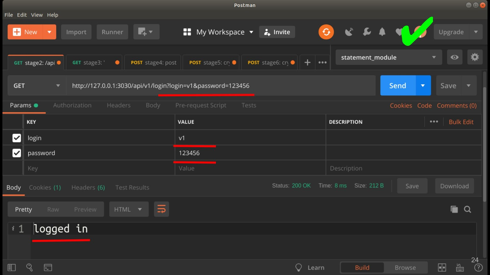
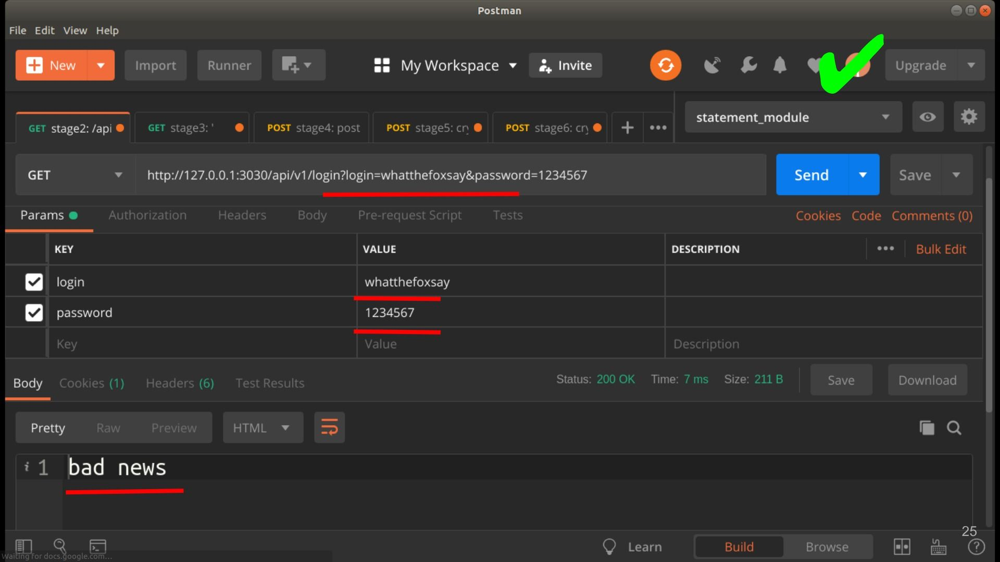
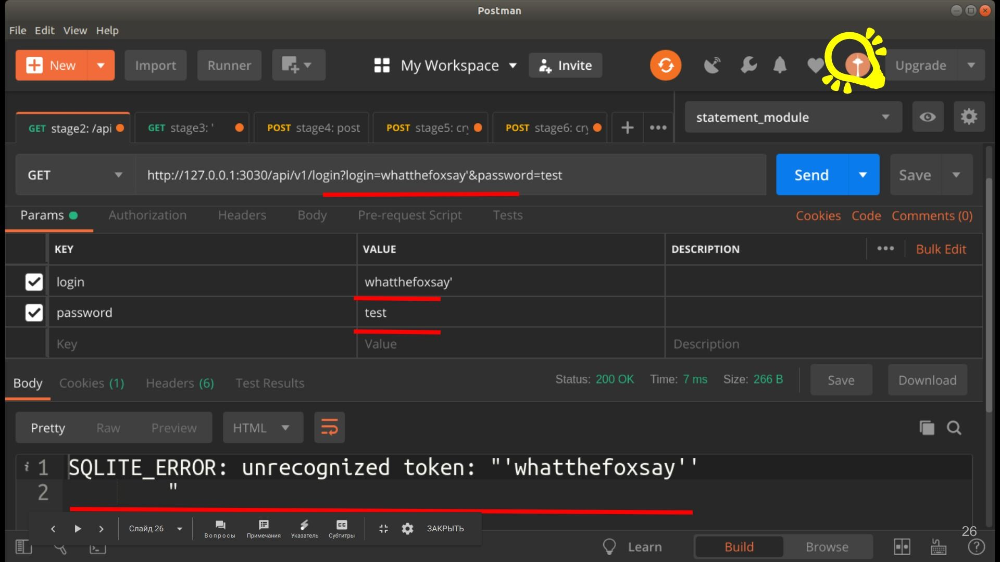
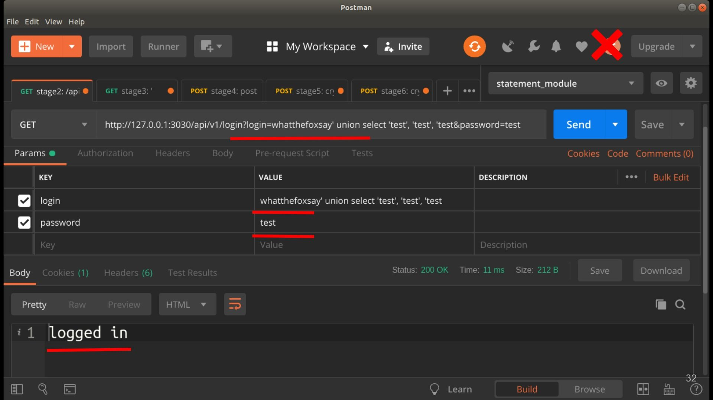
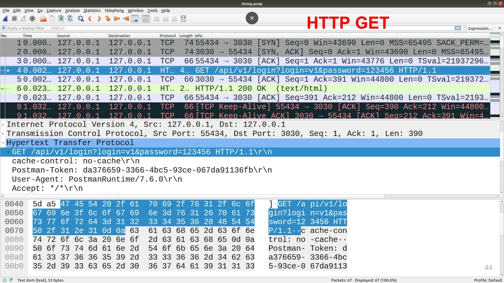
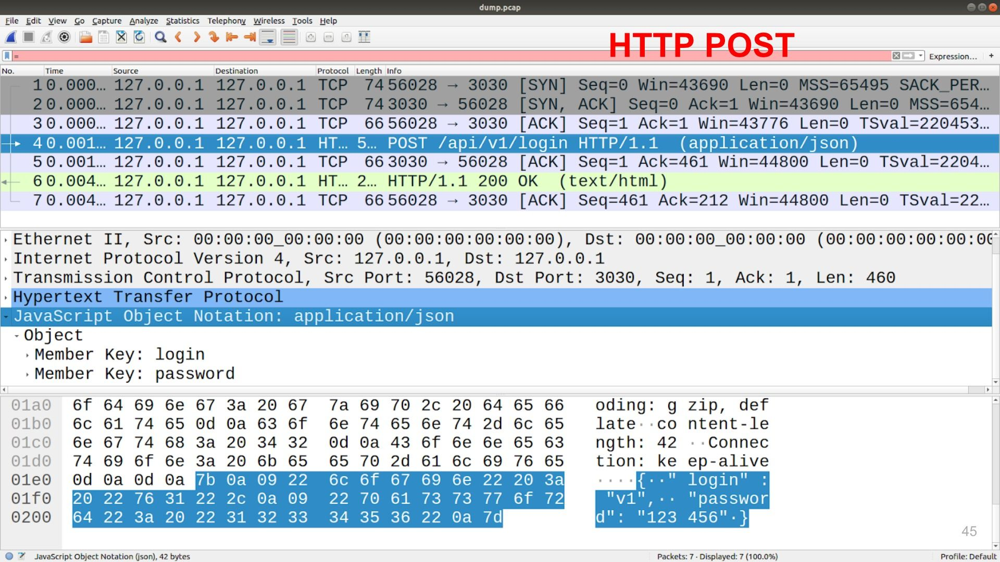
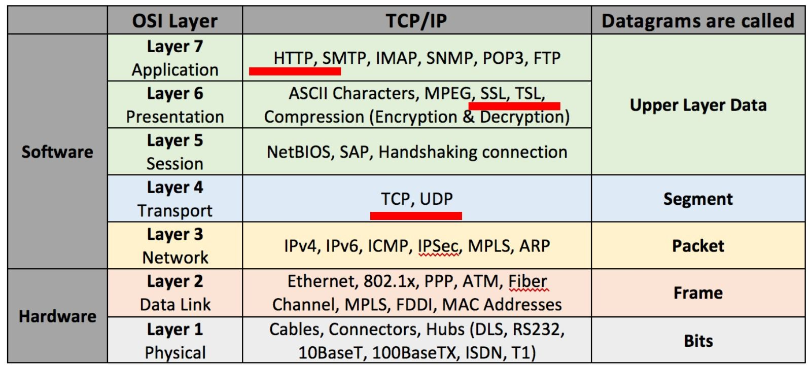
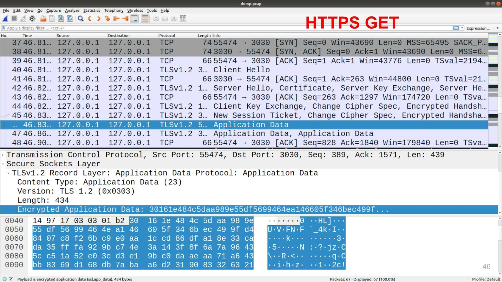
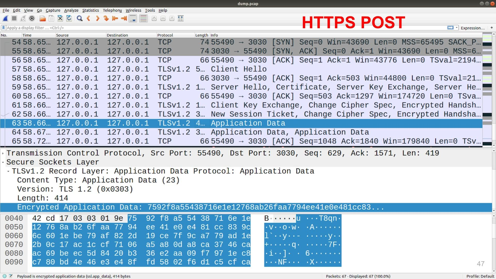
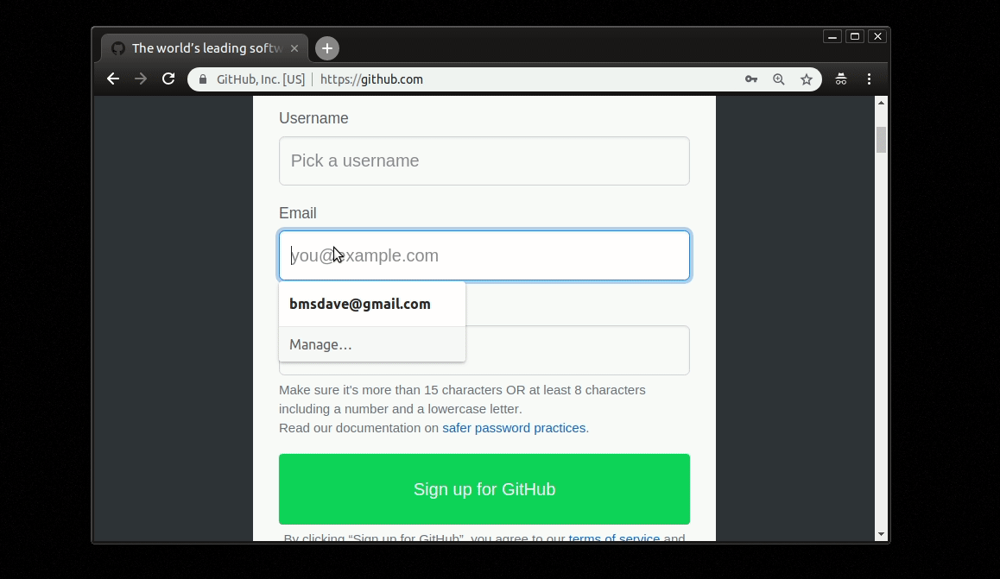

## Введение

Приветствую.

Последней каплей вдохновения для этого поста стал перевод [курса MIT «Безопасность компьютерных систем»](https://habr.com/ru/company/ua-hosting/blog/354874/) от [@ua-hosting](https://habr.com/ru/company/ua-hosting/), огромное спасибо им за это. Если кто-то еще не читал/смотрел этот курс, то я настоятельно его рекомендую.

А для затравки и в качестве введения для этого поста приведу примеры, которые приводились во введение в этом курсе.

В первую очередь хочется сказать, что материал который предоставляется в этом посте нельзя использовать в незаконных целях и направлен на то, чтобы мы как разработчики знали как может вести себя злоумышленник и были защищены от этого, а не наоборот. Если вы захотите попробовать некоторые из подходов на практике, то прочитайте вот эту статью ["Ответы юриста: как избежать ответственности за поиск уязвимостей"](https://xakep.ru/2017/01/12/lawyer-answers-hacker-responsibility-howto/).

### Cool story 1

В определенный момент времени Yahoo решила дать своим пользователям получать доступ к аккаунту не только по логину и паролю, но и в случае, если вы забыли пароль, ответить на пару вопросов, ответ на который могли знать только вы (т.к. у них не было возможности отправить вам пароль на какой либо другой резервный аккаунт).

И в один прекрасный день, [Сара Пэйлин](https://ru.wikipedia.org/wiki/%D0%9F%D1%8D%D0%B9%D0%BB%D0%B8%D0%BD,_%D0%A1%D0%B0%D1%80%D0%B0), у которой был ящик на Yahoo, обнаружила, что данные ее почтового ящика утекли. Дело в том, что на кодовые вопросы для доступа к аккаунту были «Где вы посещали школу? Как звали вашего друга? Когда у вас день рождения?», а ответы на эти вопросы были на ее странице в википедии. И каждый мог получить доступ к ее аккаунту, просто прочитав страницу о ней.  

### Cool story 2

Еще один "прекрасный" случай произошел с парнем по имени [Мэт Хонан](https://twitter.com/mat). Злоумышленников заинтересовал твиттер этого человека. Из персонального сайта нашли его email - mhonan@gmail.com, а информация Whois одного из проектов говорила что его адрес 1559B Sloat Blvd, San Francisco. Далее злоумышленник через форму восстановления пароля google узнал его резервный ящик m••••n@me.com. Ящики на me.com - это по совместительству еще и AppleID -  идентификатор, используемый для совершения покупок в магазине AppStore. Дабы восстановить пароль к аккаунту @me.com через звонок в техподдержку Apple, необходимо знать:

1. адрес почты @me.com;
2. billing address - адрес проживания;
3. последние 4 цифры кредитной карты, привязанной к AppleID.

Первые два пункта хакер уже знал. Осталось узнать последние 4ре цифры кредитки, и в этом ему помог Amazon. Хакер позвонил в техподдержку Амазона, представился Мэттом и сказал, что хочет привязать к аккаунту еще одну кредитную карту. Все что нужно знать для этого - ФИО, мыло и адрес. Далее он повесил трубку и позвонил еще раз, но уже с другим запросом - он "забыл пароль от аккаунта" и хотел бы привязать еще один ящик для восстановления пароля. Всё, что нужно знать в таком случае - ФИО, адрес и номер свежей добавленной кредитной карты (!). Теперь осталось зайти на страничку Амазона и посмотреть последние 4 цифры привязанной старым хозяином кредитной карты. Вуаля!
Подробнее об этом случае можно почитать [здесь](http://www.itsec.pro/2012/08/blog-post_7.html).

Какие выводы мы можем сделать по этим примерам:

1. Взлом подразумевает наличие “плохого парня”
2. Подход к ИБ должен быть глобальным
3. Чем меньше мы открываем данных, тем безопаснее система.

Но давайте продолжим и рассмотрим технические детали и возможные уязвимости одного из основополагающих процессов - процесса аутентификации.

Так же очень хочется уделить особое внимание инструментам, которые помогут нам не быть слепыми котятами и дать возможность более прозрачно видеть детали процесса отправки запросов. В частности, изначально пост назывался "Анализ уязвимостей форм для аутентификации", но я из него убрал слово "форм", так как хочется показать такой инструмент, как postman.

### Инструментарий

1. Postman
2. tcpdump
3. wireshark
4. katools (kali linux tool)
5. puppeteer
 
Давайте рассмотрим очень простой пример.

## Очень простой пример

Задача: нам нужно по логину и паролю аутентифицировать пользователя.

Для этого создадим табличку:

```sql
CREATE TABLE users (
    login TEXT NOT NULL UNIQUE,
    password TEXT NOT NULL
);
```

Как БД будем использовать `sqlite3`.

И напишем запрос аутентификации:

```javascript
app.get('/api/v1/login', (req, res) => {
    db.all(`
        SELECT rowid AS id, login, password
           FROM users
            WHERE login = '${req.query.login}'
        `, function(err, rows) {
        if (err) {
            res.send(err.message);
        } else {
            let loginFlag = false;
            if (rows && rows.length > 0) {
                if (req.query.password === rows[0].password) {
                    loginFlag = true;
                }
            }
        res.send(loginFlag ? "logged in" : "bad news");
        }
    })
})
```

Полный листинг сервера [здесь](https://github.com/bmsdave/talk-auth-vulnerabilities/blob/master/example/server.v2.js).

Что здесь происходит, по `GET` запросу, мы идем в БД и ищем запись по логину.
Если такая есть, сверяем пароль который к нам пришел с тем, который записан в БД.
Если все ок выводим `"logged in"`, если нет `"bad news"`.
В базе у нас заведен пользователь с логин = "v1" и паролем "123456".

Этот код, является отличным рассадником уязвимостей, давайте посмотрим почему.

Во-первых. Давайте воспользуемся Postman и составим запрос:
`127.0.0.1:3030/api/v1/login?login=v1&password=123456`.

<figure style="text-aling: center;">
    
    <figcaption>Postman запрос с правильными login/pass</figcaption>
</figure>

В ответ, мы получим `"logged in"`, если мы введем другие данные, например `127.0.0.1:3030/api/v1/login?login=whatthefoxsay&password=test`, то получим `"bad news"`, т.е. API работает и выполняет свою задачу.

<figure style="text-aling: center;">
    
    <figcaption>Postman запрос с неправильными login/pass</figcaption>
</figure>

## SQL инъекции

Но что будет, если мы отправим: `127.0.0.1:3030/api/v1/login?login=whatthefoxsay'&password=test`

<figure style="text-aling: center;">
    
    <figcaption>Postman запрос с '</figcaption>
</figure>

На придет `SQLITE_ERROR: unrecognized token: "'whatthefoxsay''"`


Происходит это потому, что мы используем вот такую конструкцию:

```javascript
login = '${req.query.login}'
```

И в результате формирования запроса мы получим:

```sql
SELECT rowid AS id, login, password
   FROM users
   WHERE login = 'whatthefoxsay'';
```

Где есть синтаксическая ошибка в виде последнего знака `'`.

Ок. получив эту ошибку, мы можем догадаться что при обращении `/api/v1/login` идет запрос в БД с поиском логина и пароля.
Значит мы можем попробовать каким-то образом немного изменить запрос и подставить туда свои данные.

### UNION

в `SQL` есть оператор `UNION`, который позволяет объединять запрос в один по строкам. Работает он так:

```sql
SELECT 1,2,3 UNION SELECT 3,2,1;
```

Выведет:

```sql
1,2,3
3,2,1
```

Давайте попробуем им воспользоваться:

```x
/login?login=whatthefoxsay' union select 'test', 'test&password=test
```

Получим:

```x
SQLITE_ERROR:
SELECTs to the left and right of UNION do not have the same number of result columns
```

ага, в данном ответе нам говорят что количество колонок не совпадает. Ок. Давайте это исправим:

```x
/login?login=whatthefoxsay' union select 'test', 'test', 'test&password=test
```

<figure style="text-aling: center;">
    
    <figcaption>hacked</figcaption>
</figure>

Получаем: `logged in`

Вуаля! мы прошли аутентификацию.

Как нам обезопаситься от таких случаев?
Все драйвера для БД должны предоставлять инструменты для экранирования входных параметров.
В примере с sqlite3 нам нужно использовать вместо:

```javascript
    conn.all(`
        SELECT rowid AS id, login, password
           FROM users
            WHERE login = '${req.query.login}'
        `,
        function (err, rows) {}
    );
```

Вот это:

```javascript
    conn.all(`
            SELECT rowid AS id, login, password
            FROM users
            WHERE login = $login
        `, {
            $login: req.body.login
        },
        function (err, rows) {}
    );
```

Полный листинг сервера [здесь](https://github.com/bmsdave/talk-auth-vulnerabilities/blob/master/example/server.v3.js).


В этом случае символ `'` будет экранироваться и мы получим что-то типа:
`login = 'whatthefoxsay\' union select \'test\', \'test\', \'test'`

Что нас спасет и при попытке отправить:

```x
/login?login=whatthefoxsay' union select 'test', 'test', 'test&password=test
```

Получим:  `bad news`

Драйвера всегда предоставляют возможность безопасной интерполяции параметров. Используете это!

Например в документации psycopg2 (python драйвер для работы с postgresql), написано:

> Warning: Never, never, *NEVER* use Python
string concatenation (+) or string parameters
interpolation (%) to pass variables to a SQL
query string. Not even at gunpoint.

> Предупреждение: Никогда, никогда, НИКОГДА не используйте конкатенацию строк (+) или (%) интерполяцию, чтобы передать параметры в SQL запрос. Даже под дулом пистолета.

Разобрались.
Давайте пойдем дальше, и заметим, что мы отсылаем `GET` запрос с нашим логином и паролем.
Мало того! Мы используем `http` вместо `https`! Нужно помнить о том, что URL запроса (часть которого - это `GET` параметры)гораздо чаще логируются `HTTP` серверами и если у злоумышленника будет доступ к логам сервера, он сможет получить их.

## TCP/HTTP(s) GET vs POST

в случае, с `HTTP`, что с `POST`, что c `GET` возможна очень простая [атака посредника (Man in the middle (MITM))](https://ru.wikipedia.org/wiki/%D0%90%D1%82%D0%B0%D0%BA%D0%B0_%D0%BF%D0%BE%D1%81%D1%80%D0%B5%D0%B4%D0%BD%D0%B8%D0%BA%D0%B0),
если конечно у нас есть возможность оказаться посередине. Как пример, вот вы пришли в кафе, подключились к wifi.
А какой-то плохой парень взломал роутер и решил записать весь трафик проходящий через него, чтобы узнать куда ходят посетители кафе.

В этом случае он на одном из узлов записывает tcp-дамп:

```bash
sudo tcpdump -i lo port 3030 -w ./dump.pcap
```

Здесь

* `-i lo` - сетевой интерфейс который мы слушаем, так как у меня все развернуто локально я слушаю `localhost`.
* `port 3030` - чтобы не засорять эфир, ограничимся портом 3030, который слушает наше приложение.
* `-w ./dump.pcap` - говорит писать дамп в файл.

После отправим два запроса и `GET`, и `POST` на наше API аутентификации `/api/v1/login`.
По завершению записи мы воспользуемся `wireshark`, чтобы посмотреть что получилось.
И увидим, что в дампе оказались наши два запроса с явками и паролями.

<figure style="text-aling: center;">
    
    <figcaption>HTTP GET</figcaption>
</figure>


<figure style="text-aling: center;">
    
    <figcaption>HTTP POST</figcaption>
</figure>

Давайте подключим `HTTPS` и перейдем на `POST`

Для начала создадим самоподписанные сертификаты:

```bash
openssl req -nodes -new -x509 -keyout server.key -out server.cert
```

Теперь подключим их к нашему приложению:

```javascript
const express = require('express');
const app = express();
const bodyParser = require('body-parser');
app.use(bodyParser.json());

const fs = require('fs');
const https = require('https');
const privateKey  = fs.readFileSync('./server.key', 'utf8');
const certificate = fs.readFileSync('./server.cert', 'utf8');
const credentials = {key: privateKey, cert: certificate};

app.post('/api/v1/login', (req, res) => {
  /* здесь без изменений */
})

const httpsServer = https.createServer(credentials, app);
httpsServer.listen(3030);
```

Полный листинг сервера [здесь](https://github.com/bmsdave/talk-auth-vulnerabilities/blob/master/example/server.v4.js)

Если мы посмотрим на `HTTPS` трафик, то здесь будет все хорошо, так как `SSL/TLS` шифрует данные "между" TCP и HTTP протоколами (см. картинку ниже), т.е. все данные HTTP-запроса будут зашифрованы. Кстати, с `HTTPS` тоже могут быть проблемы, если сотворить определенную магию с сертификатами, но мы этой темы касаться не будем, скажу одно использовать самоподписанные сертификаты в большинстве случаев является плохой практикой.

<figure style="text-aling: center;">
    
    <figcaption>Модель OSI</figcaption>
</figure>

А вот что видно в дампе:

<figure style="text-aling: center;">
    
    <figcaption>HTTPS GET</figcaption>
</figure>


<figure style="text-aling: center;">
    
    <figcaption>HTTPS POST</figcaption>
</figure>


Если отойти от аутентификации, архитектурный стиль `REST API` для получения данных рекомендует именно `GET`.
Но давайте представим, что вы пишете приложение для мед.страховой, где есть API `/users`, которое принимает параметры:
Имя, фамилия, отчество, дата рождения и номер полиса ДМС.
В таком случае наш запрос должен выглядеть примерно так:
`/users?name=Vadim&last_name=Gorbachev&polic=123456`.
Соответственно эта информация осядет в логах HTTP сервера, который пример запрос, и эти в них злоумышленник сможет получить пароль в незашифрованном виде. Ах да! шифрование пароля! Это следующая часть нашего доклада.

## Шифрование (crypto vs bcrypt)

давайте зашифруем наши пароли, чтобы не хранить в БД в открытом виде, для этого воспользуемся модулем `crypto`:

```javascript
crypto.createHash('md5').update(password).digest('hex');
```

Полный листинг сервера [здесь](https://github.com/bmsdave/talk-auth-vulnerabilities/blob/master/example/server.v5.js).

Окей, кажется теперь получше, да? Не совсем.

Во-первых, не используете `MD5`, почему спросите вы?
А потому, что команда:

```javascript
crypto.createHash('md5').update('123456').digest('hex');
```

сгенерирует нам хэш: `e10adc3949ba59abbe56e057f20f883e`

И если мы воспользуемся таким инструментом как google, то получим:
`https://google.gik-team.com/?q=e10adc3949ba59abbe56e057f20f883e`
что ваш хэш уже даже проиндексирован в поисковике.

Этот пример, конечно утрированный, если мы введем пароль, к примеру `whatthefoxsay`, его будет сложнее найти, так как он не настолько простой как `123456`. Но тем, не менее взломать его возможно. И вообще, криптография нам дает только время. Т.е. любой хэш со временем можно взломать. Важно понимать что время может быть равно 10 секундам и 1 млн. лет. Поэтому чем более криптостойкие алгоритмы вы используете, тем надежнее у вас защита (но помните, что она никогда не будет равна 100%, хотя при хороших условиях будет к этому значению стремиться).

Кстати, хотелось бы упомянуть такой инструмент как `katools` который является сборником инструментов для анализа уязвимостей репозитория `Kali Linux`. в его состав входит такая вещь как  `findmyhash`.
И с помощью команды 

```bash
findmyhash MD5 -h e10adc3949ba59abbe56e057f20f883e
```

мы cможем опросить популярные источники "не знаю ли они такого хэша?".

И мы получим:

```bash
***** HASH CRACKED!! *****
The original string is: 123456


The following hashes were cracked:
----------------------------------

e10adc3949ba59abbe56e057f20f883e -> 123456
```

Крайне не рекомендую вводить в подобные инструменты боевые хэши которые вы используете на проде.

MD5 плох! Поэтому давайте воспользуемся, чем-то более надежным.

```javascript
const getFuncSHA512Salt = (salt) => {
    return (password) => {
        var hash = crypto.createHmac('sha512', salt);
        hash.update(password);
        var value = hash.digest('hex');
        return value;
    }
};
const cryptoSHA512Salt = getFuncSHA512Salt("HVHSNrRWpP1ZSR4bnjXpiHCS1ENYcUuHO")
```

[Листинг](https://github.com/bmsdave/talk-auth-vulnerabilities/blob/master/example/server.v6.js).

Хотел отметить, что здесь мы добавляем соль `HVHSNrRWpP1ZSR4bnjXpiHCS1ENYcUuHO`.
Такое использование, это минимальный способ шифрования который стоит использовать в наше время (возможно, будет не так страшно использова `sha256`, но все же).

В той же [документации к crypto](https://nodejs.org/api/crypto.html):

```javascript
const secret = 'abcdefg';
const hash = crypto.createHmac('sha256', secret)
                   .update('I love cupcakes')
                   .digest('hex');
```

Они по умолчанию приводят пример хеширования уже с солью. Спасибо им! 

Давайте немного отвлечемся и рассмотрим еще одну cool story.
https://www.opennet.ru/opennews/art.shtml?num=46768

### Cool story 3

Возможно, вы помните как npm отозвал пароли около 170 тыс. аккаунтов и вот [этот пост](https://blog.npmjs.org/post/161515829950/credentials-resets). А все дело в том, что очень интересный человек [Сковорода Никита Андреевич @ChALkeR](https://github.com/ChALkeR), который сейчас состоит в рабочей группе по безопасности node.js, провел анализ уязвимости аутентификации пользователей в npm.

возможно вы использовали пакеты из списка: 
Express, EventEmitter2, mime-types, semver, npm, fstream, cookie (и cookies), Bower, Component, Connect, koa, co, tar, css, gm, csrf, keygrip, jcarousel, serialport, basic-auth, lru-cache, inflight, mochify, denodeify, и многие другие.

К которым Никита получил доступ и описал подробности в статье опубликованной [2015-12-04](https://github.com/ChALkeR/notes/blob/master/Do-not-underestimate-credentials-leaks.md).

Позже он провел еще одно исследование от опубликованное [2017-06-21](https://github.com/ChALkeR/notes/blob/master/Gathering-weak-npm-credentials.md)

В котором рассказал что ситуация слабо изменилась. В этот раз список ТОП пакетов был такой:
debug, qs, supports-color, yargs, commander, request, strip-ansi, chalk, form-data, mime, tunnel-agent, extend, delayed-stream, combined-stream, forever-agent, concat-stream, vinyl, co, express, escape-html, path-to-regexp, component-emitter, moment, ws, handlebars, connect, escodegen, got, gulp-util, ultron, http-proxy, dom-serializer, url-parse, vinyl-fs, configstore, coa, csso, formidable, color, winston, node-sass, react, react-dom, rx, postcss-calc, superagent, basic-auth, cheerio, jsdom, gulp, sinon, useragent, deprecated, browserify, redux, array-equal, bower, jshint, jasmine, global, mongoose, vhost, imagemin, highlight.js, tape, mysql, mz, nock, rollup, gulp-less, rework, xcode, ionic, cordova, normalize.css, electron, n, react-native, ember-cli, yeoman-generator, nunjucks, koa, modernizr, yo, mongoskin, и многие другие.


Результаты оказались ошеломляющими:

1. из 126 тыс, удалось получить доступ к 17 тыс, что примерно 13%
2. Количество пострадавших пакетов 73983 — 14% экосистемы.
3. Количество пострадавших через зависимости - 54%
4. Получил аккаунты 4 пользователей из списка топ-20
5. 42 пользователя имели более 10 миллионов загрузок в месяц (каждый).
6. 13 пользователей имели более 50 миллионов.
7. Одним из аккаунтов с доступом к koa был "password"
8. 662 - «123456», 174 — «123», 124 — password». 
9. 11% пользователей повторно использовали свои просочившиеся пароли: 10,6% - напрямую, и 0,7% — с очень незначительными изменениями.
10. т.е. он мог бы контролировать 1 972 421 945 загрузок в месяц (напрямую), это 20% от общего числа.

Заметьте `662` пользователей использовали пароль `123456`. А вы говорите, я утрирую =)

Один из кейсов получения паролей, был использование базы утекших паролей с других ресурсов.
Например, вы зарегистрировались с паролем `whatthefoxsay` в npm и на сайте blabla.site. Если взломают сайт blabla.site и получат все явки из него. Как вы думаете злоумышленники не захотят пройтись по ТОП-20 сайтам (таких как gmail, facebook, twitter, ..., npm, github) с попытками ввода логинов/паролей из базы?
Чтобы проверить есть ли у вас утекшие логины, можно воспользоваться https://haveibeenpwned.com/ , который рекомендует npm.
Будете ли вы получать спам на почту после того как введете вашу почту? Я не знаю, но если вы доверяете npm и их рекомендациям, то можете проверить =)

Возможно, хороший способ обезопасить себя от подобных ситуаций является использование менеджеров паролей.
Можно ознакомиться с топом в [этой статье](https://habr.com/ru/post/357192/), многие рекомендуют `1password`.
Но давайте не будет на этом задерживаться и пойдем дальше.

### crypto vs bcrypt

Давайте, обратимся к гуру интернетов чтобы узнать действительно ли мы делаем все правильно.
И по запросу `node.js best practice` наткнемся на [репозиторий](https://github.com/i0natan/nodebestpractices#6-security-best-practices),
который действительно содержит очень много нужных и полезных рекомендаций + к этим рекомендациям многие прислушиваются, о чем свидетельствуют звездочки на github, которых около 23 тыс.
В нем есть раздел `6-security-best-practices`, в котором даются советы и на часть примеров которые мы рассмотрели и на многие другие ситуации.
Среди которых есть пункт: [6.8. Avoid using the Node.js crypto library for handling passwords, use Bcrypt](https://github.com/i0natan/nodebestpractices/tree/15_Jan_19#-68-avoid-using-the-nodejs-crypto-library-for-handling-passwords-usebcrypt)

Пароли или секреты (ключи API) должны храниться с использованием безопасной функции `hash + salt`, такой которую предоставляет `bcrypt`, которая должна быть предпочтительным выбором по сравнению с реализацией JavaScript из-за соображений производительности и безопасности.

Также обратим внимание на призыв не использовать `Math.random()` в алгоритмах шифрования.
Не будем углубляться, но кому интересно почитайте статью Майорова [Случайные числа не случайны](https://medium.com/@frontman/%D1%81%D0%BB%D1%83%D1%87%D0%B0%D0%B9%D0%BD%D1%8B%D0%B5-%D1%87%D0%B8%D1%81%D0%BB%D0%B0-%D0%BD%D0%B5-%D1%81%D0%BB%D1%83%D1%87%D0%B0%D0%B9%D0%BD%D1%8B-252e08e60828).

Но вернемся к crypto vs bcrypt. Нам предлагают использовать код:

```javascript
// asynchronously generate a secure password using 10 hashing rounds
bcrypt.hash('myPassword', 10, function(err, hash) {
  // Store secure hash in user record
});

// compare a provided password input with saved hash
bcrypt.compare('somePassword', hash, function(err, match) {
  if(match) {
   // Passwords match
  } else {
   // // Passwords don't match
  }
});
```

Давайте же последуем совету!
И перепишем наше API на:

```javascript
bcrypt.hash("whatthefoxsay", 10, function(err, hash) {
    // Store secure hash in user record
    db.createUser(conn,'v7', hash)
});

app.post('/api/v1/login', (req, res) => {
    conn.all(`
        SELECT rowid AS id, login, password
           FROM users
            WHERE login = $login
        `, {
            $login: req.body.login
        },
        function (err, rows) {
            if (err) {
                res.send(err.message);
            } else {
                if (rows && rows.length > 0) {
                    // compare a provided password input with saved hash
                    bcrypt.compare(
                        req.body.password,
                        rows[0].password,
                        function(err, match) {
                            res.send(match ? 'logged in' : 'bad news');
                        }
                    );
                } else {
                    res.send('bad news');
                }
            }
        })
})
```

[Листинг сервера](https://github.com/bmsdave/talk-auth-vulnerabilities/blob/master/example/server.v7.js).

Кажется что все выглядит пуленепробиваемое! Но!

Заметим один нюанс. Давайте попробуем устроить небольшой брутфорс пар логин+пароль по нашему API.

Воспользуемся подобной функцией:

```javascript
const sendRequest = function (login, password) {
    const result = {
        start: Date.now(),
        login,
        password
    }
    const promise = new Promise(function (res, rej) {
        request.post(
            'https://127.0.0.1:3030/api/v1/login',
            { json: { login, password } },
            function (error, response, body) {
                if (!error && response.statusCode == 200) {
                    result.end = Date.now();
                    res(result);
                }
            }
        );
    })
    return promise;
}
```

И отправим по 10 запросов на каждый из логинов `v7`, `v7_wrong`, `v7_wrong2`

```bash
$ node ./attaker.js 
v7 917
v7_wrong 40
v7_wrong2 39
```

хмм.. давайте отправим еще раз:

```bash
$ node ./attaker.js
v7 837
v7_wrong 42
v7_wrong2 45
```

Заметим что ответы с логином `v7` заметно отличаются от остальных. Что здесь происходит, а происходит то, что если пользователь мы угадали, дальше идет тяжелый, надежный алгоритм `bcrypt`, который шифрует нам `password` из запроса и пытается сравнить с хэшем из БД.
А давайте попробуем вернуть `crypto` и `sha512` с солью:

```bash
$ node ./attaker.js
v6 54
v6_wrong 32
v6_wrong2 30
finish
```

Заметим, что здесь разница не такая значительная, и если мы хостились на удаленной машине, а не на `localhost`, то погрешность в скорости прохождения пакетов по сети просто бы съела это 20-30 мс в 10 запросов. Значит ли это что `bcrypt` плох? Конечно нет. Мы просто неправильно его готовим, о чем, к сожалению best practice нам не говорит. На момент написания статьи, мы обсуждаем этот момент в [issue](https://github.com/i0natan/nodebestpractices/issues/325), присоединяйтесь.

Но если мы изменим наш код таким образом, чтобы мы всегда вычисляли хэш.
Например:

```javascript
if (rows && rows.length > 0) {
    // compare a provided password input with saved hash
    bcrypt.compare(req.body.password, rows[0].password, function(err, match) {
        console.log('good');
        res.send(match ? 'logged in' : 'bad news');
    });
} else {
    bcrypt.compare(
        req.body.password,
        "$2b$10$m.fhQdLyRI8ExS/GGh43FOkO.XTCS85QdVpn6sINdlxTGQSJe3Ydi",
        function(err, match) {
            console.log('bad');
            res.send('bad news');
        }
    );
}
```

То получим:

```bash
$ node ./attaker.js
v7 786
v7_wrong 778
v7_wrong2 762
finish
```

Что вполне нас обезопасит от тайминговых атак.
Кстати, по этой теме есть хорошая [статья](https://habr.com/ru/company/alfa/blog/338170/)

## usability vs security

Напоследок хочется рассмотреть еще один пример. Который не связан с аутентификацией напрямую. Но связан с формой регистрации.
Сейчас фронтендеры ослеплены лучшими практиками UX, все стараются максимально ублажить пользователя и иногда в этой спешке теряются важные нюансы, о которых не стоит забывать.

Как пример, в [статье](https://habr.com/ru/post/268253/) предлагается уведомлять пользователя, после того как он ввел почту, зарегистрирован акк на этот email или нет. Это конечно красиво, но не до конца. Конечно мы можем добавить какие-то дополнительные проверки, на то чтобы выявить что к нам за проверкой почты стучится человек, а не машина. Но вы посмотрите за окно!

Сейчас на улице другие законы! [селфдрайвинг кары сбивают промо роботов](https://twitter.com/bobuk/status/1082691244730535937).


И есть такой волшебный инструмент как puppeteer, с помощью которого притвориться человеком гораздо проще.
И мы можем брутфорсом пройти по форме регистрации и собрать базу email'ов пользователей, тех или иных ресурсов.

Для этого есть спасение - это ограничение количества запросов. Например как это делает github. На его ограничение даже можно наткнуться руками, если очень настырно пытаться его спрашивать.

<figure style="text-aling: center;">
    
    <figcaption>где-то на 40 github начнет ругаться</figcaption>
</figure>

## Ссылки на источники

0. [Листинги кода и примеры описанные в статье](https://github.com/bmsdave/talk-auth-vulnerabilities)
1. [Курс MIT «Безопасность компьютерных систем»](https://habr.com/ru/company/ua-hosting/blog/354874/)
2. [Ответы юриста: как избежать ответственности за поиск уязвимостей]()
3. [Про Мэта Хонан](http://www.itsec.pro/2012/08/blog-post_7.html)
4. [psycopg2: The problem with the query parameters](http://initd.org/psycopg/docs/usage.html#the-problem-with-the-query-parameters)
5. [Тайминговая атака на Node.js — когда время работает против вас](https://habr.com/ru/company/alfa/blog/338170/) 
6. [Исследование @ChALkeR](https://www.opennet.ru/opennews/art.shtml?num=46768)
7. [Майоров "Случайные числа не случайны"](https://medium.com/@frontman/%D1%81%D0%BB%D1%83%D1%87%D0%B0%D0%B9%D0%BD%D1%8B%D0%B5-%D1%87%D0%B8%D1%81%D0%BB%D0%B0-%D0%BD%D0%B5-%D1%81%D0%BB%D1%83%D1%87%D0%B0%D0%B9%D0%BD%D1%8B-252e08e60828) 
8. [Node.js best practices list](https://github.com/i0natan/nodebestpractices)
9. [Node.js Security Working Group](https://github.com/nodejs/security-wg)
10. [Юзабилити форм авторизации](https://habr.com/ru/post/268253/)


Спасибо!