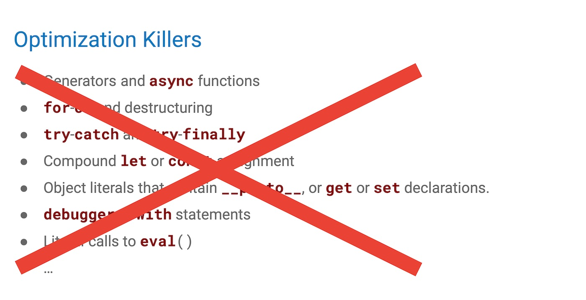
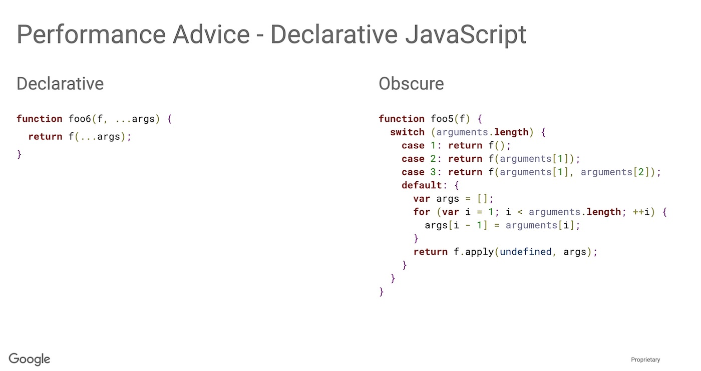
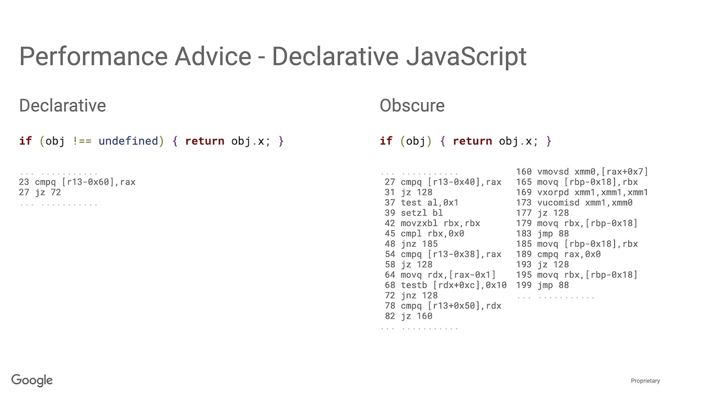

# Микрооптимизации производительности и JavaScript


Недавно [в комментариях на Hexlet я поучаствовал в дискуссии](https://www.facebook.com/Hexlet/photos/a.191527631005918/1441750875983581/?type=1&theater) на тему «Что важнее — оптимизации производительности или качество кода?» Если вернуться чуть назад, то исходный вопрос звучал так — нужно ли использовать перебирающие методы массивов (т.е. Array.prototype.map(),  Array.prototype.filter(), Array.prototype.reduce() и т.д.) или стоит остановиться на старом добром цикле for ввиду его явного превосходства в производительности?

Казалось бы, такой простой вопрос одновременно поднимает две важные проблемы. Первая — вред от устаревающего знания о специфике реализации, и вторая — должна ли производительность кода стоять во главе угла.

Разберём по порядку.

### Устаревающее знание о специфике поведения интепретаторов

JavaScript является интерпретируемым языком. Это значит, что при написании кода, мы никак не контролируем то, как будет выглядеть код в виде машинных инструкций. Это полностью зависит от движка, исполняющего наш JavaScript, и этих движков великое множество. Например, в Chrome наш код исполняется с помощью движка V8, в Safari это JavaScriptCore, в Firefox — SpiderMonkey. И это далеко не все. Более того, каждый движок имеет множество версий. И вот, что интересно — все браузерные движки являются конкурентами. Но как они могут конкурировать между собой за любовь пользователя? Кто-то скажет — поддержкой самых современных фишек EcmaScript! Но нет, на самом деле пользователям по большему счёту всё равно, насколько хорошо браузер что-то там поддерживает. Интерфейс приятный? Все сайты работают? И работают быстро?

Стоп. Всё должно работать быстро. Вот где секрет.

Каждый движок борется за то, чтобы один и тот же корректный JavaScript-код в одинаковых условиях (операционная система, количество ОЗУ, мощность процессора) работал в нём быстрее. Как это возможно? Как один и тот же код в, казалось бы, одинаковых условиях может исполняться с разной скоростью? Всё дело в оптимизациях.

За счёт мощнейших оптимизаций, происходящих во время выполнения кода, интерпретируемые языки достигают сравнимых (а порой и превосходящих) результатов с компилируемыми языками. Каждый такой движок содержит JIT(Just In Time)-компилятор, который анализирует исходный код и входные параметры, и генерирует оптимизированный машинный код под заданные условия.

Можем ли мы как-то повлиять на генерируемый код? Да. Мы можем:

- предварительно «прогревать» методы, заранее вызывая их несколько раз с нужным набором данных, тем самым принудительно заставляя движок начинать оптимизации;
- следить за мономорфностью типов входных данных, так как при любом изменении входящих типов движок будет вынужден перестроить оптимизированный код и мы потеряем драгоценные миллисекунды;
- избегать использования каких-то конструкций в языке, основываясь на знаниях об их плохой оптимизации.

И вот тут мы вступаем в серую зону. В наш код, который должен жить долго, завезено знание о том, как именно движки превращали эти JavaScript-инструкции в машинный код **в какой-то конкретный момент времени**.

Так что же, если нам не нужно писать **максимально** производительный код (что мы обсудим во второй части), то можно закрыть глаза на внутреннюю реализацию и писать что угодно? Есть ли разница между отказом от перебирающих методов массивов и отказом от неявных проверок на истинность объекта, отдавая предпочтение прямому сравнению с undefined?

```javascript
    // Мы хотим убедиться, что объект существует,
    // а движок должен догадаться, что лежит в переменной - ссылка
    // на объект или примитив, и какого типа этот примитив
    if (someObject) {}
    // Мы явно говорим движку, что нам не важно, что лежит в    
    // переменной, главное - что она объявлена
    if (someObject !== undefined) {}
    // Совсем хардкор. Мы оптимизируем код используя знания о том,
    // что undefined - это всего лишь поле в глобальном объекте. 
    // Движок должен убедиться, что оно не переопределено,
    // а void 0 вернёт «чистый» undefined, который не надо
    // дополнительно проверять. Нет никаких гарантий, что эта
    // оптимизация будет актуальна завтра.
    if (someObject !== void 0) {}
```

Явность. Вот ключевое слово. Между неявным и явным мы должны выбирать явное. Так же как явное решение подскажет программисту, который будет дальше работать с этим кодом, что тут происходит, так же оно может подсказать интерпретатору, как сгенерировать оптимальный код. Наши знания об оптимизациях устаревают, но явное остаётся явным. Движки действительно плохо оптимизировали перебирающие методы несколько лет назад. Однако сейчас код, написанный с помощью таких конструкций, может быть даже более производительным. Для примера взглянем на бенчмарки 2017 года после проведения оптимизаций в V8.

[https://twitter.com/goodmodule/status/840227134689935362](https://twitter.com/goodmodule/status/840227134689935362)

Почему новые конструкции языка в итоге выигрывают в гонке оптимизаций? Потому что с их помощью движок уже точнее может предположить то, что вы действительно хотите сделать в этом участке кода. Простой цикл ему не подскажет, а вот перебирающий метод — очень даже.

Хотите другой пример? Не верите на слово?

[Бенедикт Маурер](https://benediktmeurer.de/), один из разработчиков движка V8, [приводит достаточно наглядные примеры](https://docs.google.com/presentation/d/1_eLlVzcj94_G4r9j9d_Lj5HRKFnq6jgpuPJtnmIBs88/edit#slide=id.p) того как использование новых синтаксических конструкций приводит к оптимизации выходного машинного кода.


Вариант слева в 4.5 раз быстрее варианта справа (на момент доклада)

При этом сравните количество ментальных усилий, необходимых для того, чтобы понять, что делает код справа. Да, он простой, но код слева сильно проще!
Кстати, есть пример и с приведённым выше случаем явного сравнения с undefined. Сравните объём машинного кода, необходимого для корректной обработки неявного условия.



Что же хотят сказать нам ребята из Google этим докладом? Пишите простой явный код, а интерпретатор сделает хорошо за вас. Просто подскажите ему, как сделать лучше.

Существуют ли «убийцы оптимизации», когда новая хайповая конструкция языка превращается в тонну неэффективного кода? Безусловно. У каждого движка есть свои проблемы, и ещё не все оптимизации сделаны. Должны ли мы об этом беспокоится, чтобы уже сегодня наш код работал быстрее?

Об этом вторая часть статьи.

## Является ли производительность кода важнейшим критерием качества?

Нужно ли помнить обо всех «убийцах производительности»? Нужно ли предпочитать менее читабельные конструкции хорошим новым методам? Мне кажется, ответ скрывается за двумя вопросами:

1. Есть ли у вас проблемы с производительностью?
2. На какие жертвы вы готовы пойти ради достижения пиковой производительности?

Известно высказывание, приписываемое Дональду Кнуту:

> Преждевременная оптимизация – корень всех зол.

Интересно, что [существует как минимум три версии этой фразы](http://sergeyteplyakov.blogspot.com/2009/12/blog-post_08.html), и одна из них:

> We should forget about small efficiencies, say about 97% of the time: premature optimization is the root of all evil. Yet we should not pass up our opportunities in that critical 3.

Иначе говоря, не нужно оптимизировать там, где ещё нет проблемы. Проведите нагрузочное тестирование и оно покажет, является ли ваш код бутылочным горлышком. Думаю, что в большей части случаев — нет. Использование современных конструкций языка не навредит производительности системы в целом. Конечно существует определённый сегмент приложений и библиотек, где критична каждая миллисекунда — например, игры или низкоуровневые библиотеки, от работы которых зависит всё приложение. И вот в этом случае мы переходим ко второму вопросу.

Какую жертву вы готовы принести? Готовы ощутить себя Таносом, пришедшим за Камнем Души? Готовы сделать свой код малопонятным и сложно поддерживаемым? Это только малая часть и вы конечно же готовы к ней, как и любой профессиональный программист. Но готовы ли вы к тому, что придётся отслеживать все новые релизы движков, делать замеры и своевременно переписывать ручные оптимизации, балансируя при этом между тремя основными игроками на рынке? Ну ладно, про Firefox вы можете забыть, но Safari с его JavaScriptCore всё равно принадлежит существенная часть рынка. Если готовы и, главное, выполнен пункт 1, то дерзайте! Но не заставляйте делать это тех, кому не нужна эта заоблачная производительность.

Если вспомнить историю языков программирования, то мы всегда жертвовали производительностью ради повышения абстракций, как только железо это позволяло. Например, ассемблер позволяет писать более производительный код, чем C, а код на Java — гораздо медленнее кода на C. Нам нравятся высокоуровневые абстракции и те ограничения, которые они на нас накладывают. Потому что это позволяет писать более понятный и поддерживаемый код. Прототипное наследование требует меньших ресурсов, чем наследование на классах, но оно неудобно, требует внимательности и хорошего понимания принципов работы. Запрет мутаций в функциональном программировании — чудесная идея, снижающая количество ошибок, но эта идея ведёт к перерасходу памяти. К счастью, у нас растёт производительность процессоров и снижается цена на память. Как только мы переходим определённую черту, мы делаем шаг в сторону снижения производительности ради удобства и надёжности.

Конечно же, мы всегда можем сделать шаг назад. Если у нас в node.js не хватает производительности в JavaScript-коде, мы можем спуститься на уровень C и написать супер-оптимизированный код, который, к сожалению, будет больно и дорого поддерживать. В этот момент к нам приедет знание о компиляторах и платформах, наш код перестанет быть легко переносимым между системами и нам понадобятся специалисты другого уровня.

Такова цена гонки за производительностью. Помните об этом и не делайте код хуже (с точки зрения читабельности и поддерживаемости) только ради мифического выигрыша в 1ms в редких случаях.

Что почитать по теме:
[Продуманная оптимизация](http://optimization.guide)
