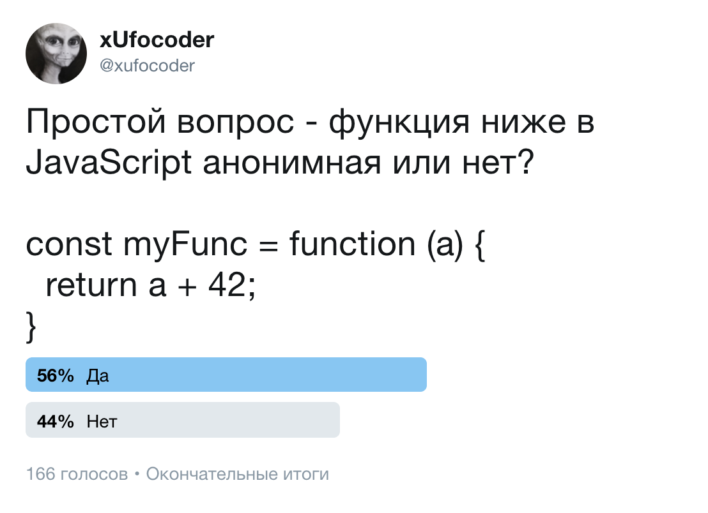
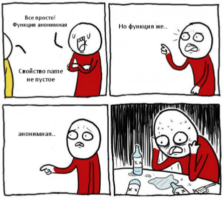

# Анонимные функции в JavaScript

Разбираемся в том, что является анонимной функцией или какая связь между анонимными функциями в JavaScript и подбрасыванием монетки? Может ли функция с именем быть анонимной?


**tl;tr;**

JavaScript-разработчик, запомни! Если после **function** есть имя — функция именованная, во всех остальных случая анонимная. 

### В интернете кто-то не прав

Все началось с простого вопроса в канале Telegram для изучающих JavaScript, в котором, помимо всего прочего, появился  вопрос касательно обработчиков событий в браузере. Вопрос был в том, как они «навешиваются» и «снимаются» с DOM-элемента. Среди ответов от вполне опытного разработчика был следующий:

> Обработчик снимается также, как он вешался. Если вешалась анонимная функция, то никак. Только удалять элемент из DOM и из памяти.

Далее ответ был подкреплен блоком кода похожим на этот:

```
element.addEventListener('click', function() { /* .. */ })
element.removeEventListener('click', function() { /* .. */ })
```


На что в качестве возражения с моей стороны был приведен следующий блок кода, показывающий, что **анонимная функция может быть удалена как обработчик**:

```
const handleClick = () => { /* */ }

element.addEventListener('click', handleClick)
element.removeEventListener('click', handleClick)
```


### В twitter как на работу

После этого недопонимания мною же было решено поинтересоваться у общественности через twitter, касательно вытекающего вопроса, что же является анонимной функцией, а что нет? 

И для этого было вполне достаточно спросить насчёт небольшого блока кода:



Учитывая возможные колебания в результатах из-за появившихся ответов в комментариях, статистика **практически 50/50**, это все равно, если бы мы подбрасывали монетку.

Также задавал этот вопрос в личной беседе опытным JavaScript-разработчикам, выступающим на митапах с докладами, и людям не из мира фронтенда, результат развед-допроса был сильно похож на статистику ответов в twitter.

### Я знал ответ, это же просто

Если на опрос выше вы ответили, что **функция myFunc является анонимной**, поздравляю—это правильно! Отметьте этот день красным цветом в календаре, позовите родных и близких, начинайте разливать шампанское по бокалам.

Итак, значит функция в коде блока выше является анонимной:

```
const myFunc = function() { };
```

А что, если я тебе скажу, что ты можешь обратится к свойству name, и получить конкретное значение? 

```
myFunc.name // "myFunc"
```




Полученное значение не пустое, но при этом функция выше как мы выяснили, анонимная, но это же какой-то понятийный коллапс, товарищи! Не торопитесь уходить в backend-разработку, Шерлок Холмс уже начал свое расследование.

### Как задать функцию в JavaScript

[Function constructor](https://developer.mozilla.org/en-US/docs/Web/JavaScript/Reference/Functions#The_Function_constructor):

```
`new Function ([arg1[, arg2[, ...argN]],] functionBody)`
```

[Function declaration](https://developer.mozilla.org/en-US/docs/Web/JavaScript/Reference/Functions#The_function_declaration_(function_statement)):

```
function name([param[, param,[..., param]]]) {
   [statements]
}
```

[Function expression](https://developer.mozilla.org/en-US/docs/Web/JavaScript/Reference/Functions#The_function_expression_(function_expression)):

```
const myFunc = function [name]([param1[, param2[, ..., paramN]]]) {
   statements
}
```

[Arrow function](https://developer.mozilla.org/en-US/docs/Web/JavaScript/Reference/Functions/Arrow_functions):

```
(param1, param2, …, paramN) => { statements } 
(param1, param2, …, paramN) => expression
```

[Object Method](https://developer.mozilla.org/en-US/docs/Web/JavaScript/Reference/Functions/Method_definitions):

```
const obj = {
  property( parameters… ) {},
  [property]( parameters… ) {},
};
```

К тому же, не стоит забывать о существовании [Generator Function](https://developer.mozilla.org/en-US/docs/Web/JavaScript/Reference/Functions#The_GeneratorFunction_constructor) и об специальном синтаксисе с использованием [async](https://developer.mozilla.org/en-US/docs/Web/JavaScript/Reference/Statements/async_function), плюс вспомним о [setters](https://developer.mozilla.org/en-US/docs/Web/JavaScript/Reference/Functions/set), [getters](https://developer.mozilla.org/en-US/docs/Web/JavaScript/Reference/Functions/get). Все это добавляет вариации в вышеуказанные способы определения функций.


### Усиливаем пример с определением имени. Тесты

```
const myFunc  = function() { };                       //  1 
const myFuncA = function myFuncA2() { };              //  2
const myFuncB = () => { };                            //  3
const myFuncC = new Function()                        //  4

const property = Symbol('symbolProperty')

const myObject = { 
  methodA: function() { },                            //  5
  methodB: function MyMethodB() {},                   //  6
  methodC: () => { },                                 //  7
  methodD(){ },                                       //  8
  [property](){ }                                     //  9
}

function myFuncD() { };                               // 10
(function() { })()                                    // 11
(function myFuncF(){ })()                             // 12
```

Теперь, используя описанные способы выше, возьмём у каждой функции свойство **name**, и начнем с функций, заданных как [Function expression](https://developer.mozilla.org/en-US/docs/Web/JavaScript/Reference/Functions#The_function_expression_(function_expression)):

```
myFunc.name                       // "myFunc"
myFuncA.name                      // "myFuncA"
myFuncB.name                      // "myFuncB"
myFuncC.name                      // "myFuncC"
```

Функции, объявленные как [Object Method](https://developer.mozilla.org/en-US/docs/Web/JavaScript/Reference/Functions/Method_definitions):

```
myObject.methodA.name             // "methodA"
myObject.methodB.name             // "MyMethodB"
myObject.methodC.name             // "methodC"
myObject.methodD.name             // "methodD"
myObject[property].name           // "[symbolProperty]"
```

Функции, объявленные как IIFE ([Immediately-invoked function expression](https://developer.mozilla.org/en-US/docs/Glossary/IIFE)):

```
(function myFuncD() { }).name     // "myFuncD"
(function() { }).name             // ""
(function myFuncF(){ }).name      // "myFuncF"

(new Function()).name             // "anonymous"
```

Вопросов возникает ещё больше. А может функция в опросе из twitter все таки именованная? Может я ввел вас в заблуждение? 

### Спецификация. Хардкор

Возможно кто-то считает, что когда-то трава была зеленее, небо голубее и вода мокрее, но в мире JavaScript раньше было определенно хуже! И только начиная со стандарта **[ECMA-262 6th Edition](https://www.ecma-international.org/ecma-262/6.0/)** появилась определенность в понятии анонимной функции, в частности в главе **[14 ECMAScript Language: Functions and Classes](https://www.ecma-international.org/ecma-262/6.0/#sec-ecmascript-language-functions-and-classes)**, посвященной функциям и классам, в пункте **[14.1.9 IsAnonymousFunctionDefinition](https://www.ecma-international.org/ecma-262/6.0/#sec-isanonymousfunctiondefinition)**:

```
**14.1.9 Static Semantics: IsAnonymousFunctionDefinition( production )**

  1. If **IsFunctionDefinition** of production is false, return false.
  2. Let **hasName** be the result of **HasName** of production.
  3. If **hasName** is true, return false.
  4. Return true
```

Откуда получаем, что для полного понимания придется разобраться в семантике **[IsFunctionDefinition](https://www.ecma-international.org/ecma-262/6.0/#sec-function-definitions-static-semantics-isfunctiondefinition)**: 

```
**14.1 Function Definitions
14.1.11 Static Semantics: IsFunctionDefinition**

  FunctionExpression: 
    function ( FormalParameters ) { FunctionBody }
      1. Return true.
    function BindingIdentifier ( FormalParameters ) { FunctionBody }
      1. Return true.
```

А также разобраться в семантике **[hasName](https://www.ecma-international.org/ecma-262/6.0/#sec-function-definitions-static-semantics-hasname)**:

```
**14.1 Function Definitions
14.1.8 Static Semantics: HasName**

FunctionExpression:
  function ( FormalParameters ) { FunctionBody }
     1. Return false.
  function BindingIdentifier ( FormalParameters ) { FunctionBody }
     1. Return true.
```

Из семантики **[hasName](https://www.ecma-international.org/ecma-262/6.0/#sec-arrow-function-definitions-static-semantics-hasname)** для **[Arrow Function](https://www.ecma-international.org/ecma-262/6.0/#sec-arrow-function-definitions)** следует, что стрелочные функции всегда анонимны:

```
**14.2 Arrow Function Definitions
14.2.7 Static Semantics: HasName**

ArrowFunction: 
  ArrowParameters => ConciseBody
    1. Return false.
```

С описанием метода объекта дела обстоят несколько сложнее, поскольку может использоваться старый синтаксис через *AssignmentExpression* или новый через *MethodDefinition*:

```
**12.2 Primary Expression**
**12.2.6 Object Initializer**
    ..
    PropertyDefinition :
      ..
      PropertyName : AssignmentExpression
      MethodDefinition
```

Также помним, что свойству объекта может быть присвоена в качестве значения функция, откуда получаем следующие вариации для метода:

```
const myObject = { 
  myMethodA: function() {},         // 1
  myMethodB() {}                    // 2
};

myObject.myMethodB = function() {}; // 3
```

В первом случае, опосредованно используется **[14.1.9 IsAnonymousFunctionDefinition](https://www.ecma-international.org/ecma-262/6.0/#sec-isanonymousfunctiondefinition)** для проверки, что описано в **[12.2.6.9 Runtime Semantics: PropertyDefinitionEvaluation](https://www.ecma-international.org/ecma-262/6.0/#sec-object-initializer-runtime-semantics-propertydefinitionevaluation)**. Во втором же случае имеем то, что функция задается через **[FunctionCreate](https://www.ecma-international.org/ecma-262/6.0/#sec-functioncreate)** семантику внутри **[14.3.8 Runtime Semantics: DefineMethod](https://www.ecma-international.org/ecma-262/6.0/#sec-runtime-semantics-definemethod)** семантики.

Не удивлюсь, если вы уже устали и запутались, а ведь это далеко не все и я опустил часть перекрестных ссылок между разделами и пунктами спецификации. Лично мне в процессе подготовки статьи удалось запутаться дважды. 

Что же стоит запомнить? Все случаи с описанием методов сводятся к Function Expression, где свойству объекта задается в качестве значения функция.

Собирая все воедино, для себя выделил простое правило: если после **function** есть идентификатор, другими словами имя, тогда функция именованная, во всех остальных случаях анонимная.

### Возвращаемся к тестам и ставим точку.

Весь этот путь был проделан не зря, теперь мы с полной уверенностью и без капли сомнения сможем определить, когда функция именованная, когда нет:

```
const myFunc  = function() { };                // 1 - анонимая 
const myFuncA = function myFuncA2() { };       // 2 - именованная 
const myFuncB = () => { };                     // 3 - анонимая 
const myFuncC = new Function()                 // 4 - анонимая

const property = Symbol('symbolProperty')
const myObject = { 
  methodA: function() { },                     // 5 - ?
  methodB: function MyMethodB() {},            // 6 - ?
  methodC: () => { },                          // 7 - ?
  methodD(){ },                                // 8 - ?
  [property](){ }                              // 9 - ?
}

function myFuncD() { };                        // 10 - именованная
(function() { })()                             // 11 - анонимая
(function myFuncF(){ })()                      // 12 - именованная
```

### Стойте! А как же name?

Не стоит забывать, что JavaScript мультипарадигмальный язык программирования, где есть элементы объектно-ориентированного подхода, где функцию можно рассматривать как объект со своими свойствами. К таким свойствам относится свойство **name**, и в спецификации легко обнаружить описание **[SetFunctionName](https://www.ecma-international.org/ecma-262/6.0/#sec-setfunctionname)** в **[9.2. ECMAScript Function Objects](https://www.ecma-international.org/ecma-262/6.0/#sec-ecmascript-function-objects)**:

```
**9.2 ECMAScript Function Objects
9.2.11 SetFunctionName (F, name, prefix)**

The abstract operation SetFunctionName requires a Function argument F, a String or Symbol argument name and optionally a String argument prefix. This operation adds a name property to F by performing the following steps: 

  ..
  6. Return DefinePropertyOrThrow(F, "name", PropertyDescriptor{
      [[Value]]: name, 
      [[Writable]]: false, 
      [[Enumerable]]: false, 
      [[Configurable]]: true
     }).
  ..
```

Например, для методов именем функции будет являться имя свойства, согласно **[14.3.8 Runtime Semantics: DefineMethod](https://www.ecma-international.org/ecma-262/6.0/#sec-runtime-semantics-definemethod)** и **[14.3.9 Runtime Semantics: PropertyDefinitionEvaluation](https://www.ecma-international.org/ecma-262/6.0/#sec-method-definitions-runtime-semantics-propertydefinitionevaluation)**, а для функций созданных с помощью конструктора **[Function](https://www.ecma-international.org/ecma-262/6.0/#sec-function-constructor)**, именем функции будет “anonymous”:

```
**19.2.1.1.1 RuntimeSemantics: CreateDynamicFunction(constructor, newTarget, kind, args)**

  ..
  29. Perform SetFunctionName(F, "anonymous").
  ..
```

И лично для себя открыл в спецификации то, как задается имя для функции, привязанной к контексту с помощью метода **bind**, что описано в разделе **[19.2.3.2 Function.prototype.bind](https://www.ecma-international.org/ecma-262/6.0/#sec-function.prototype.bind)**, например:

```
const myFunc = function() {
  console.log(this.myProperty)
}
const myBind = myFunc.bind({ myProperty: 'value' })

console.log(myBind.name); // "bound myFunc"
```

Также подобные префиксы в именах имеют функции, созданные как getter-метод объекта или setter-метод объекта, согласно **[14.3.9 Runtime Semantics: PropertyDefinitionEvaluation](http://www.ecma-international.org/ecma-262/6.0/#sec-method-definitions-runtime-semantics-propertydefinitionevaluation)**, например:

```
const myObject = {
  get myProperty() { return 42 }
}
console.log(
  Object.getOwnPropertyDescriptor(myObject, "myProperty").get.name
) // "get myProperty"
```

### AST-ановитесь!

На мой субъективный взгляд, по большей мере спецификация это предписание для интерпретатора EcmaScript, держать такой же в  собственной голове есть дело тяжелое и неблагодарное.

Чтобы не тратить драгоценное [мыслетопливо](https://habr.com/ru/company/oleg-bunin/blog/348714/) на разбор синтаксиса, как вариант, достаточно воспользоваться одним из существующих EcmaScript-парсеров, который поможет определить наличие идентификатора функции и каким способом она была задана.

Например, [здесь](https://astexplorer.net/#/gist/aaebf64850c6f5997c3a976326843e23/bd064819c9e04d7776b441169390b6714840f738) представлено абстрактное синтаксическое дерево, для ранее созданных тестов, с помощью инструмента [ASTExplorer](https://astexplorer.net).

### Вывод

Как мы выяснили функция, будучи анонимной, может иметь имя, поскольку одновременно является также и объектом, что есть следствие мультипарадигмальной природы языка JavaScript.

В спорах о синтаксисе языка, обращайтесь к первоисточнику, то есть к спецификации EcmaScript актуальной версии.

Изучайте JavaScript! JavaScript — во имя добра!
